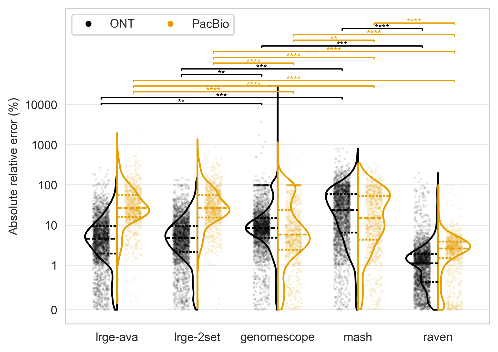
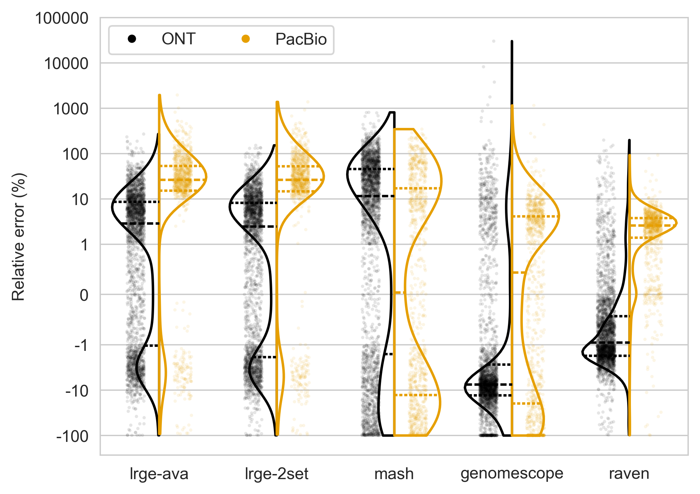
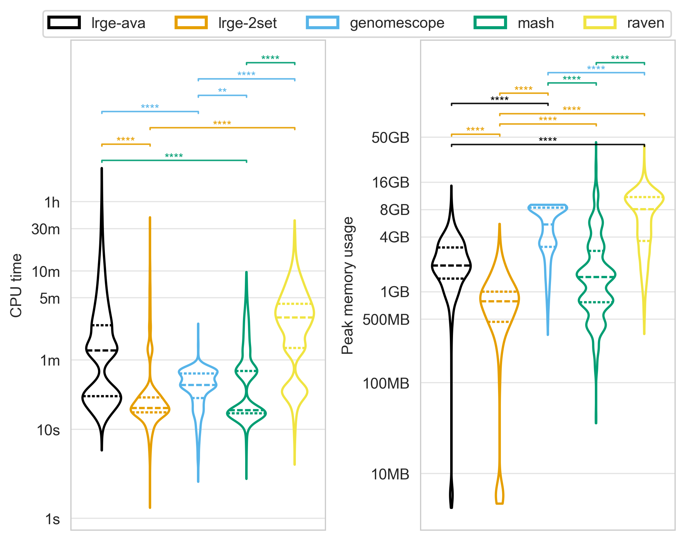

# LRGE

[](https://github.com/mbhall88/lrge/actions/workflows/check.yml)
[](https://github.com/mbhall88/lrge/actions/workflows/test.yml)

**L**ong **R**ead-based **G**enome size **E**stimation from overlaps

LRGE (pronounced "large") is a command line tool for estimating genome size from long read overlaps. The tool is built 
on top of the [`liblrge`][liblrge] Rust library, which is also available as a standalone library for use in other projects.

> PREPRINT/PAPER COMING SOON

## Table of Contents

- [Installation](#installation)
- [Usage](#usage)
- [Method](#method)
- [Results](#results)
- [Benchmark](#benchmark)
- [Citation](#citation)
 

## Installation

- [Precompiled binary](#precompiled-binary)
- [Conda](#conda)
- [Cargo](#cargo)
- [Container](#container)
  - [Apptainer](#apptainer)
  - [Docker](#docker)
- [Build from source](#build-from-source)

### Precompiled binary


```shell
curl -sSL lrge.mbh.sh | sh
# or with wget
wget -nv -O - lrge.mbh.sh | sh
```

You can also pass options to the script like so

```
$ curl -sSL lrge.mbh.sh | sh -s -- --help
install.sh [option]

Fetch and install the latest version of lrge, if lrge is already
installed it will be updated to the latest version.

Options
        -V, --verbose
                Enable verbose output for the installer

        -f, -y, --force, --yes
                Skip the confirmation prompt during installation

        -p, --platform
                Override the platform identified by the installer [default: apple-darwin]

        -b, --bin-dir
                Override the bin installation directory [default: /usr/local/bin]

        -a, --arch
                Override the architecture identified by the installer [default: aarch64]

        -B, --base-url
                Override the base URL used for downloading releases [default: https://github.com/mbhall88/lrge/releases]

        -h, --help
                Display this help message
```

### Conda


```sh
conda install -c bioconda lrge
```

### Cargo


```sh
cargo install lrge
```

### Container

Docker images are hosted on the GitHub Container registry.

#### Apptainer

Prerequisite: [`apptainer`][apptainer] (previously Singularity)

```shell
$ URI="docker://ghcr.io/mbhall88/lrge:latest"
$ apptainer exec "$URI" lrge --help
```

The above will use the latest version. If you want to specify a version then use a
[tag][ghcr] like so.

```shell
$ VERSION="0.1.1"
$ URI="docker://ghcr.io/mbhall88/lrge:${VERSION}"
```

#### Docker

Prerequisite: [`docker`][docker]

```shell
$ docker pull ghcr.io/mbhall88/lrge:latest
$ docker run ghcr.io/mbhall88/lrge:latest lrge --help
```

You can find all the available tags [here][ghcr].

### Build from source

```shell
$ git clone https://github.com/mbhall88/lrge.git
$ cd lrge
$ cargo build --release
$ target/release/lrge -h
```

---

## Usage

> [!IMPORTANT]  
> The default values were calibrated from bacterial genomes, so you may need to adjust them if you are working with larger
genomes. See below for more details.

Estimate the genome size of a set of *Mycobacterium tuberculosis* ONT [reads](https://www.ebi.ac.uk/ena/browser/view/SRR28370649) 
([true genome size](https://www.ebi.ac.uk/ena/browser/view/CP149484): 4.40 Mbp / 4405449 bp).

```
$ wget -O reads.fq.gz "ftp://ftp.sra.ebi.ac.uk/vol1/fastq/SRR283/049/SRR28370649/SRR28370649_1.fastq.gz"
$ lrge -t 8 reads.fq.gz
[2024-11-22T03:49:53Z INFO  lrge] Running two-set strategy with 10000 target reads and 5000 query reads
[2024-11-22T03:50:10Z INFO  lrge] Estimated genome size: 4.43 Mbp (IQR: 3.16 Mbp - 4.99 Mbp)
4426642
[2024-11-22T03:50:10Z INFO  lrge] Done!
```

The size estimate is printed to stdout, but you can also save it to a file with the `-o` flag.

```
$ lrge -t 8 reads.fq.gz -o size.txt
[2024-11-22T03:49:53Z INFO  lrge] Running two-set strategy with 10000 target reads and 5000 query reads
[2024-11-22T03:50:10Z INFO  lrge] Estimated genome size: 4.43 Mbp (IQR: 3.16 Mbp - 4.99 Mbp)
[2024-11-22T03:50:10Z INFO  lrge] Done!
$ cat size.txt
4426642
```

By default, LRGE uses the [two-set strategy](#two-set-strategy) with 10,000 target reads (`-T`) and 5,000 query reads 
(`-Q`). You can use the [all-vs-all strategy](#all-vs-all-strategy) by specifying the number of reads to use with the `-n` flag.

In the paper, we ran LRGE on three eukaoryotic genomes: *Arabidopsis thaliana* (125 Mbp), *Drosophila melanogaster* 
(143 Mbp), and *Saccharomyces cerevisiae* (12 Mbp). We used 50,000 query and 100,000 target reads for *A. thaliana* and 
*D. melanogaster*, and 10,000 query and 20,000 target reads for *S. cerevisiae*.


### Library

You can also use the `liblrge` library in your Rust projects. This allows you to estimate genome size within your own 
applications - without needing to call out to `lrge`. For more details on how to use the library, see the [documentation](https://www.docs.rs/liblrge) or the 
[source code](./liblrge).

### Standard options

```
$ lrge -h
Genome size estimation from long read overlaps

Usage: lrge [OPTIONS] <INPUT>

Arguments:
  <INPUT>  Input FASTQ file

Options:
  -o, --output <OUTPUT>      Output file for the estimate [default: -]
  -T, --target <INT>         Target number of reads to use (for two-set strategy; default) [default: 10000]
  -Q, --query <INT>          Query number of reads to use (for two-set strategy; default) [default: 5000]
  -n, --num <INT>            Number of reads to use (for all-vs-all strategy)
  -P, --platform <PLATFORM>  Sequencing platform of the reads [default: ont] [possible values: ont, pb]
  -t, --threads <INT>        Number of threads to use [default: 1]
  -C, --keep-temp            Don't clean up temporary files
  -D, --temp <DIR>           Temporary directory for storing intermediate files
  -s, --seed <INT>           Random seed to use - making the estimate repeatable
  -q, --quiet...             `-q` only show errors and warnings. `-qq` only show errors. `-qqq` shows nothing
  -v, --verbose...           `-v` show debug output. `-vv` show trace output
  -h, --help                 Print help (see more with '--help')
  -V, --version              Print version
```

### Full usage

Estimate genome size of PacBio reads

```
$ lrge -P pb -t 8 reads.fq
```

Don't remove the intermidiate read and overlap files

```
$ lrge -C reads.fq
```

Use the [all-vs-all strategy](#all-vs-all-strategy) with 10,000 reads

```
$ lrge -n 10000 reads.fq
```

Fix the seed so that subsequent runs return the same size estimate

```
$ lrge -s 123 reads.fq
```

By default, we take the median of the *finite* estimates to get the final genome size estimate. If you want to include 
infinite estimates in the calculation

```
$ lrge -8 reads.fq
```

If you don't want the estimate to be rounded to the nearest integer 🤓

```
$ lrge --float-my-boat reads.fq
```

In [the paper][doi], we suggest using the 15th and 65th percentiles of the estimates to get a ~92% confidence interval. 
However, you can change these

```
$ lrge --q1 0.25 --q3 0.75 reads.fq
```

If you want to see the estimate for each read, turn on trace level logging

```
$ lrge -vv reads.fq
```

By default, the intermediate files are stored in a temporary directory. You can specify a different temporary 
directory

```
$ lrge -D ./mytemp/ reads.fq
```

---

```
$ lrge --help
Genome size estimation from long read overlaps

Usage: lrge [OPTIONS] <INPUT>

Arguments:
  <INPUT>
          Input FASTQ file

Options:
  -o, --output <OUTPUT>
          Output file for the estimate

          [default: -]

  -T, --target <INT>
          Target number of reads to use (for two-set strategy; default)

          [default: 10000]
  -Q, --query <INT>
          Query number of reads to use (for two-set strategy; default)

          [default: 5000]

  -n, --num <INT>
          Number of reads to use (for all-vs-all strategy)

  -P, --platform <PLATFORM>
          Sequencing platform of the reads

          [default: ont]
          [possible values: ont, pb]

  -t, --threads <INT>
          Number of threads to use

          [default: 1]

  -C, --keep-temp
          Don't clean up temporary files

  -D, --temp <DIR>
          Temporary directory for storing intermediate files

  -s, --seed <INT>
          Random seed to use - making the estimate repeatable

  -8, --inf
          Take the estimate as the median of all estimates, *including infinite estimates*

  -f, --float-my-boat
          I neeeeeed that precision! Output the estimate as a floating point number

      --q1 <FLOAT>
          The lower quantile to use for the estimate

          [default: 0.15]

      --q3 <FLOAT>
          The upper quantile to use for the estimate

          [default: 0.65]

  -q, --quiet...
          `-q` only show errors and warnings. `-qq` only show errors. `-qqq` shows nothing

  -v, --verbose...
          `-v` show debug output. `-vv` show trace output

  -h, --help
          Print help (see a summary with '-h')

  -V, --version
          Print version
```


## Method

For a full description of the method, see the [paper][doi].

### Two-set strategy

The two-set strategy is the default method used by LRGE. It involves randomly selecting a two distinct subsets of reads 
from the input. One subset is deemed the target set ($T$) and the other the query set ($Q$). Each read $q_i$ in $Q$ is overlapped 
against $T$ and a genome size ($\textbf{GS}$) estimate is generated for that read ($\textbf{GS}_{T,q_i}$). The estimate is calculated based on 
the number of overlaps of $q_i$ with reads in $T$ ($\lvert \textbf{ov}(T \setminus q_i,q_i \rvert$), according to the formula:

```math
\textbf{GS}_{T,q_i} \approx \lvert T \setminus q_i \rvert \frac{\ell_{q_i} + \overline{\ell}_{T \setminus q_i} - 2 \cdot \textbf{OT}}{\lvert \textbf{ov}(T \setminus q_i,q_i) \rvert}
```

where $\vert T \setminus q_i \vert$ is the total size of the target set minus the read $q_i$, $\ell_{q_i}$ is the length of read $q_i$, $\overline{\ell}_{T \setminus q_i}$ is 
the average length of reads in $T$ minus $q_i$, and $\textbf{OT}$ is the overlap threshold (minimum chain score in minimap2, which 
defaults to 100 for overlaps). See [the paper][doi] for more formal/rigorous definitions.

Ultimately, the genome size estimate is the median of the finite estimates for each read in $Q$.

We use this strategy as the default as it is the most computationally efficient and the accuracy is comparable to the 
all-vs-all strategy. We suggest a smaller number of query reads than target reads, as this will speed things up and as 
we take the median of the estimates, the number of query reads (over a certain point) should not affect the accuracy of 
the estimate all that much.

### All-vs-all strategy

The all-vs-all strategy involves overlapping some random subset (`-n`) of reads in the input against each other. The 
genome size estimate for each read is calculated as above.

This strategy is *generally* more computationally expensive than the two-set strategy, but it can be more accurate. Though 
we did not find the difference to be statistically significant in our tests.

## Results

We compared LRGE to three other methods: GenomeScope2, Mash, and Raven ([see below](#alternatives) for more info). We ran 
each method on 3370 read sets from PacBio or ONT data. Each of these samples is associated with a RefSeq assembly, so the 
true size was taken as the size of the RefSeq assembly. You can find the metadata for the samples [here](./paper/config/bacteria_lr_runs.filtered.tsv).

The full results are available in the [paper][doi] and [here](./paper/results/estimates/estimates.tsv). Here is a brief summary of how LRGE compares to other methods.



This compares the absolute relative error as a percentage. The relative error ($\epsilon_{\text{rel}}$) is calculated as:

```math
    \epsilon_{\text{rel}} = \frac{\hat{G} - G}{G} \cdot 100
```

where $G$ is the true genome size, and $\hat{G}$ is the estimated genome size. For example, a $\epsilon_{\text{rel}}$ of 50% 
is out (higher or lower) by 50% of the true genome size. So if the true genome size is 1 Mbp, a $\epsilon_{\text{rel}}$ of 50% 
would be 1.5 Mbp or 0.5 Mbp. 

The following figure shows the (non-absolute) relative error for the same methods to give an 
indication of which methods tend to over or underestimate.




## Benchmark

For the full details of the methods benchmarked, see the [paper][doi]. However, here is a brief summary of the results.



The statistical annotations above the violins are coloured by the method which has the lowest mean value for the given 
metric.

## Alternatives

The methods we compare against are:

[GenomeScope2](https://github.com/tbenavi1/genomescope2.0): to get estimates from GenomeScope2, you need to first generate 
a k-mer spectrum. We used [KMC](https://github.com/refresh-bio/KMC) for this. You can find a Python script that takes reads 
and generates a k-mer spectrum in [`genomescope.py`](./paper/workflow/scripts/genomescope.py). The list of parameters used 
can also be found in the [workflow config](./paper/config/config.yaml).

[Mash](https://github.com/marbl/Mash): we used `mash sketch` on the reads, which prints out the estimated genome size in 
the logging output. You can find the options used in the [workflow config](./paper/config/config.yaml).

[Raven](https://github.com/lbcb-sci/raven): Raven essentially just assembles the reads - *REALLLLY* fast 🚀

You can find the full details of how we compared methods in the [workflow](./paper/workflow/rules/estimate.smk).

## Citation

If you use LRGE in your research, please cite the following paper:

```bibtex
COMING SOON
```

[apptainer]: https://github.com/apptainer/apptainer
[docker]: https://docs.docker.com/
[doi]: https://doi.org/TODO
[ghcr]: https://github.com/mbhall88/lrge/pkgs/container/lrge
[liblrge]: https://www.docs.rs/liblrge
[quay.io]: https://quay.io/repository/mbhall88/lrge